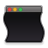

# MacOS Wobbly Windows

A wobbly windows implementation for MacOS inspired by [Compiz-Fusion](https://compiz-fusion.org/wiki_subdomain/plugins/wobbly.html) for Linux. 

*Note: this is only a proof of concept*

## 🖥 Usage

- Install SIMBL loader like using [mySIMBL](https://github.com/w0lfschild/mySIMBL) or [MacForge](https://www.macenhance.com/macforge). Note that you currently need to disable System Integrity Protection (SIP) in order for this to work.
- Download the [latest bundle](https://github.com/iamDecode/Jello/releases), or build it yourself (see Building).
- Drag bundle onto the app to enable it.
- Restart apps for WobblyWindows to take effect.

## 🛠 Building

The Xcode project contains two targets, `WobblyWindows` will run a sample window with wobble logic enabled, `WobblyWindowsInject` builds a bundle that can be used with a SIMBL loader.

## 🖋 Contributing

Feel free to make a contribution. Please read [CONTRIBUTING.md](CONTRIBUTING.md) for details on the code of conduct, and the process for submitting pull requests.
